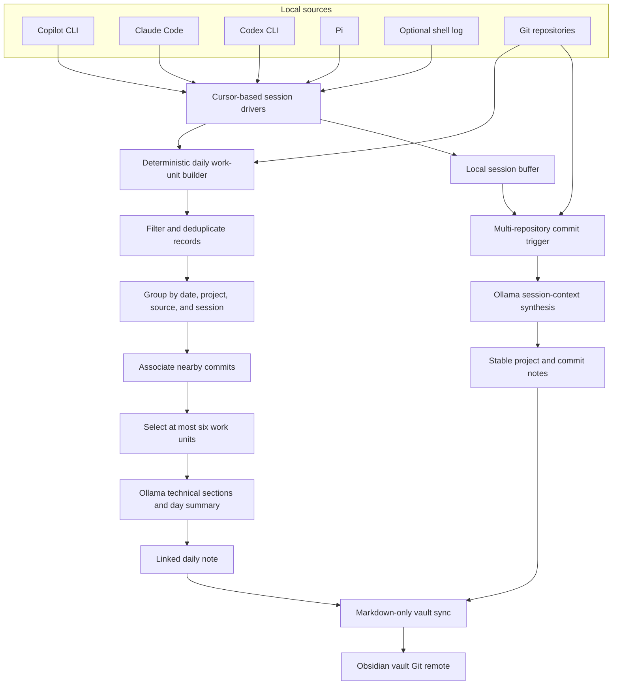

# Autograph Architecture and Data Flow

Autograph turns local development activity into a small, linked set of
Obsidian notes. It is designed to preserve useful engineering context without
making the vault a transcript archive.

## Design Principles

- **Local first:** Agent-session data and Git history are read locally. Ollama
  is used only through the configured local API endpoint.
- **Deterministic before generative:** Python code filters, deduplicates,
  groups, correlates, links, and versions records before a model sees them.
- **Bounded synthesis:** A daily note has at most six technical sections and
  one day summary. Model calls therefore scale with meaningful work units, not
  with every line in an agent transcript.
- **Stable knowledge nodes:** Projects, commits, and daily notes are stable
  Markdown nodes. The normal workflows do not create one Markdown file per
  session event.
- **Safe version control:** Autograph stages only Markdown changes in the
  vault, commits them, and pushes them to the configured Git remote. It does
  not stage unrelated Obsidian configuration changes.

## Components

| Component | Responsibility |
|---|---|
| `config/settings.py` | Loads local configuration from `.env`. |
| Session drivers | Incrementally read new records from Copilot CLI, Claude Code, Codex CLI, Pi, or the optional shell log. |
| `SessionObserverAgent` | Buffers new session activity and associates it with detected commits. |
| `MultiRepositorySessionTriggerAgent` | Watches repositories below `AUTOGRAPH_SEARCH_DIR` for new commits. |
| `DailyBackfillAgent` | Builds compact daily work units, synthesizes notes, creates links, and tracks note input fingerprints. |
| `Synthesizer` | Sends bounded, structured prompts to the configured Ollama model. |
| `VaultManager` | Writes stable project and commit notes and removes only explicitly recognized legacy fragments. |
| `AutographSyncAgent` | Pulls, stages Markdown only, commits, and pushes the vault. |

## System Flow



## Live Flow

The macOS LaunchAgent starts the session observer when you log in. The
observer uses persistent file cursors, so its first run begins at the end of
existing session files rather than importing historical activity.

1. A driver reads only new local agent-session records.
2. The observer appends normalized records to the local session buffer.
3. The commit trigger detects a new commit in a repository under
   `AUTOGRAPH_SEARCH_DIR`.
4. The observer summarizes the buffered context with Ollama and attaches it to
   that commit's stable note:
   `projects/<project>/commits/<commit-id>.md`.
5. Autograph commits and pushes changed vault Markdown.

The observer does not create standalone Markdown files for each captured
session.

## Daily Note Flow

The scheduled summary runs daily at 08:00 through `launchd`. It uses the same
pipeline as historical daily backfill.

1. Read retained local agent records within the requested time range.
2. Drop tool/system records, empty messages, repeated content, and oversized
   content.
3. Resolve each record's repository from its working directory where possible.
4. Group records by **date, repository, agent source, and session ID** into
   work units.
5. Associate a unit with the nearest subsequent commit from the same project
   when it occurs within four hours.
6. Select at most the six most substantive units for the date.
7. Ask Ollama to create one technical section for each selected unit and one
   concise day-level overview.
8. Render the linked daily Markdown note and commit/push it to the vault.

This limits a normal day to at most seven model requests: six technical
sections and one overview.

## Daily Note Shape

Each generated note is stored at `daily_notes/YYYY-MM-DD.md` and has this
shape:

```markdown
# Daily Journal: YYYY-MM-DD

## Day summary

## Commits
- [[projects/<project>/commits/<commit-id>|<short-id> <title>]]

## Technical notes

### <work-unit title>
**What was done**
**What went well**
**What we learned**
**Worth remembering**
**Related commits**
**Related project:** [[projects/<project>|<project>]]
**Agent source:** [[agents/<Agent>|<Agent>]]
**Models:** `<model>`
**Session:** [[sessions/<agent>/<session-id>|<short-id>]]

## Related notes
- [[daily_notes/YYYY-MM-DD|YYYY-MM-DD]]
```

The renderer never adds weather or a generic "today" introduction. It links
daily notes to adjacent generated days and links technical sections to known
projects and commits. Missing repository or commit metadata is left unlinked
rather than guessed.

A section carries a `**Session:**` link only when the work unit's session ID
identifies exactly one recorded session. Copilot and Claude sessions are
identified from their own records; Codex and Pi units fall back to a directory
name that names a day or a working directory, so those sections keep the agent
link alone. Models come from each transcript, so a session that switched model
lists every model it used.

## Historical Workflows

| Command | Result |
|---|---|
| `python3 run_backfill.py` | Creates stable project and commit notes for Git history. |
| `python3 run_session_backfill.py --days 14` | Uses retained session data to create compact daily notes. |
| `python3 run_daily_backfill.py --days 14` | Creates or updates compact daily notes from sessions and commits. |
| `python3 run_daily_backfill.py --days 14 --replace-generated` | Replaces only marked Autograph-generated daily notes. |
| `python3 run_daily_backfill.py --date YYYY-MM-DD --replace-generated` | Regenerates one marked daily note. |
| `python3 run_vault_cleanup.py` | Deletes only recognized legacy session-fragment notes. |
| `python3 run_all.py` | Runs Git backfill, creates the current daily note, then starts the observer. |

Historical session import is explicit because it can process private local
records. It never runs automatically at login.

## Incremental Regeneration

Autograph records a deterministic fingerprint of each generated daily note's
selected work units and commits in:

```text
~/.autograph/logs/daily_note_state.json
```

If the input fingerprint is unchanged, the existing generated note is kept.
If fresh activity changes the fingerprint, Autograph may update its generated
note. Notes without the `*Generated by Autograph Agent*` marker are treated as
manual and are never overwritten.

## Vault Layout

```text
<vault>/
  daily_notes/
    YYYY-MM-DD.md
  agents/
    <Agent>.md
  sessions/
    <agent>/
      <session-id>.md
  projects/
    <project>.md
    <project>/
      commits/
        <commit-id>.md
      events/
        ... existing historical commit events only
      entities/
        ... existing legacy entity notes
```

A session note is a stub, not a transcript: it records the agent, the session
ID, the models used, and a vault-relative reference to the local session file.
It is written once and never rewritten, so annotations added to it survive.
Obsidian backlinks show every daily note that links to a session.

The cleanup command removes obsolete event notes only when their JSON payload
contains a session `narrative` and an empty `entities` list. It does not remove
daily notes, commit notes, entity notes, manual notes, or local session source
records.

## Model Configuration

Set the Ollama model tag in `.env`:

```dotenv
AUTOGRAPH_MODEL_NAME=<installed-ollama-model-tag>
AUTOGRAPH_OLLAMA_URL=http://localhost:11434/api/generate
AUTOGRAPH_OLLAMA_TIMEOUT_SECONDS=300
```

The tag must exactly match a model returned by:

```bash
curl http://localhost:11434/api/tags
```

Model choice affects response latency, but the primary performance control is
the bounded work-unit pipeline. Changing model tags does not require a code
change; reload the LaunchAgent after changing `.env`:

```bash
./infrastructure/install_launchd.sh
```

## macOS Automation

Install or reload the two managed LaunchAgents:

```bash
./infrastructure/install_launchd.sh
```

- `com.autograph.observer` starts at login and is kept alive.
- `com.autograph.summary` runs the daily-note workflow at 08:00.
- Logs are written to `~/.autograph/logs`.

Remove both jobs with:

```bash
./infrastructure/uninstall_launchd.sh
```
